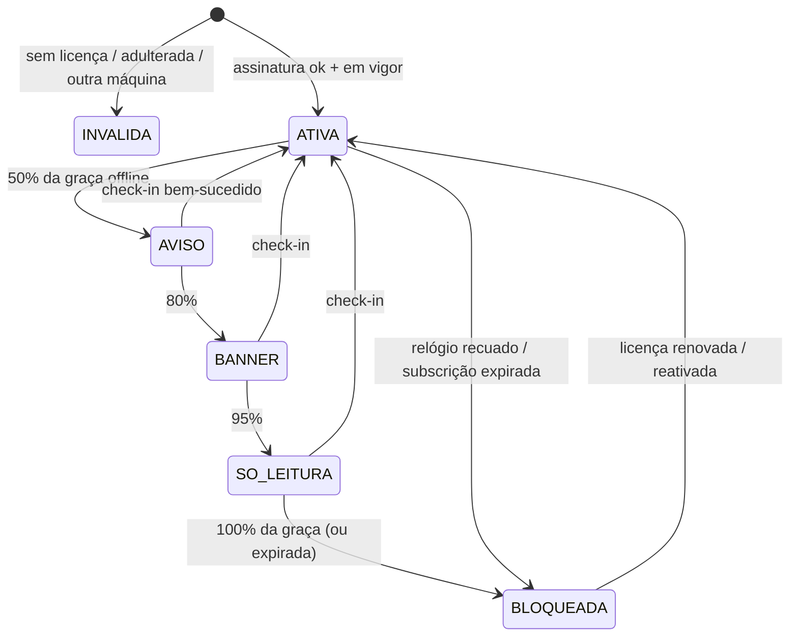
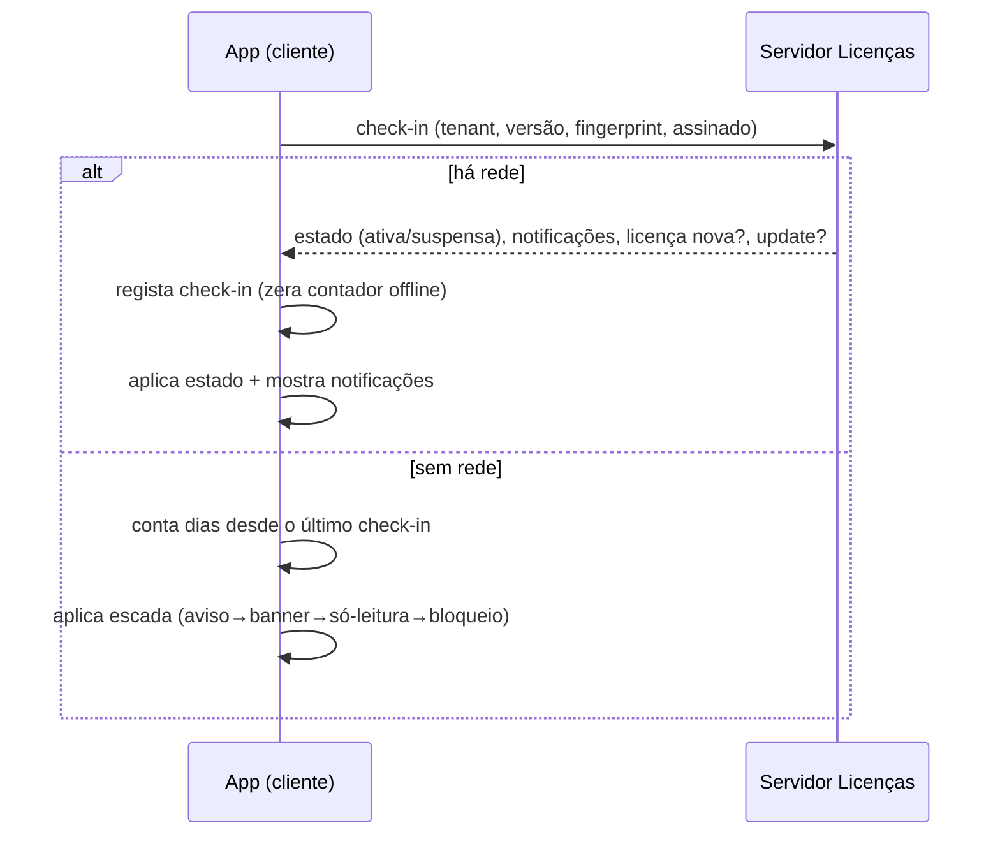

# PRD — Licenciamento Offline / On-Premise do soserp

- **Estado:** rascunho para decisão
- **Data:** 2026-08-23
- **Autor:** equipa soserp
- **Relacionado:** [DEPLOY-RUNBOOK](DEPLOY-RUNBOOK.md), [API_AGENTE_OPENCLAW](API_AGENTE_OPENCLAW.md), [AGT_FATURACAO_ROADMAP](AGT_FATURACAO_ROADMAP.md)
- **Checklist de execução:** [CHECKLIST-LICENCIAMENTO-SEGURANCA-UPDATES](CHECKLIST-LICENCIAMENTO-SEGURANCA-UPDATES.md)

---

## 1. Contexto e problema

Hoje o soserp corre **online (cloud)**: **1 instância + 1 base de dados partilhada + N tenants**, com o `tenant_id` a separar os dados (multi-tenant). Quem gere a plataforma controla tudo porque **é dono do servidor**.

Há procura por uma versão **offline / on-premise**: o cliente corre o soserp **na própria máquina/rede**, com internet intermitente ou ausente. Isto inverte o modelo — passa a ser **N instalações independentes, cada uma com 1 tenant** — e faz-nos **perder o controlo que hoje temos por sermos o servidor**.

> **Princípio que atravessa o documento:** *quanto mais offline, menos controlo real.* O controlo verdadeiro vem de "ligar a casa" (phone-home). Puro offline só permite **barreiras que atrasam** a pirataria, não que a impedem.

## 2. Objetivos

1. Distribuir o soserp como **instalador `.exe` para Windows**, que instala e configura tudo sozinho (stack + BD).
2. **Licenciar** cada instalação com uma licença **assinada criptograficamente**, verificável **sem internet**.
3. **Controlar** a instalação esteja **online ou offline**: suspender, bloquear, notificar, e **trancar ao fim de X dias sem internet** (configurável por tenant).
4. **Atualizar** o software à distância, com o **super admin a decidir por-tenant** se a atualização entra.
5. Tornar a cópia pirata **mais cara e chata do que pagar** (não "impossível" — ver §7).

## 3. Não-objetivos

- Proteção anti-pirataria **inquebrável** (não existe em software distribuído).
- Faturação fiscal **100% offline** — a AGT é online; o alvo é *offline-tolerante* (fila local, envia quando há rede). Ver §11.
- Suporte a Linux/Mac no cliente **na 1.ª fase** (o parque angolano é Windows).
- Sincronização de dados entre a cloud e a instalação offline (cada uma é a sua própria fonte de verdade).

## 4. Componentes

| Componente | Onde corre | Papel |
|---|---|---|
| **Instalador `.exe`** | Máquina do cliente (Windows) | Instala o stack (XAMPP embutido), cria/configura a BD, arranca serviços, ativa a licença |
| **App on-premise** | Máquina do cliente | O soserp de sempre + **verificador de licença** + cliente de check-in/updates |
| **Servidor de Licenças** | Infra do vendor | Emite/renova licenças assinadas; guarda estado de subscrição por tenant |
| **Servidor de Updates** | Infra do vendor | Publica versões assinadas; decide **rollout por-tenant** |
| **Painel Super Admin** | Infra do vendor | Suspender/bloquear/notificar/aprovar update por tenant (reusa muito do openclaw/subscrições) |

## 5. Requisitos funcionais

### RF1 — Instalador `.exe` para Windows (XAMPP embutido)
- **Um único `.exe`** (Inno Setup ou NSIS) que traz **o XAMPP embutido** (Apache + MariaDB/MySQL + PHP na versão certa) — o instalador leva o XAMPP, instala-o e configura-o para o cliente não ter de fazer nada.
- No 1.º arranque, de forma automática:
  1. Instala o XAMPP numa pasta dedicada (ex.: `C:\soserp\`), sem colidir com um XAMPP já existente (portas próprias).
  2. Regista **Apache e MariaDB como serviços Windows com arranque automático** (sobem sozinhos ao ligar o PC).
  3. **Cria a base de dados**, o utilizador de BD com password aleatória, e corre as **migrations + seeders** iniciais.
  4. Gera o `.env` (APP_KEY nova, ligação à BD, `LICENSE_PUBLIC_KEY` embutida, ambiente).
  5. Pede/instala o **ficheiro de licença** e valida-o (ecrã de ativação).
  6. Cria atalho/serviço que abre o soserp no browser em `http://localhost:<porta>`.
- **Desinstalador** que pára serviços e (opcionalmente) faz backup da BD antes de remover.
- **Atualização do próprio stack** (PHP/MariaDB) tratada como caso especial do RF5.
- *Nota técnica:* empacotar o soserp como binário PHP único (com Livewire) é frágil hoje; **XAMPP embutido + serviços é o caminho pragmático** para a 1.ª fase.

### RF2 — Licença assinada
- Licença = **token assinado (Ed25519)** pela chave privada do vendor; o cliente traz só a **chave pública** e verifica.
- A licença carrega: `tenant_id`, empresa, NIF, plano, **módulos permitidos**, **validade (exp)**, **fingerprint de máquina** (opcional), **dias de graça offline** (`graca`), ambiente.
- Formato: `SOSERP-LIC.v1.<payload_base64url>.<assinatura_base64url>`.
- Emissão só do lado do vendor (comando `licenca:emitir`, precisa da chave privada).

### RF3 — Verificação offline + kill-switch gradual
- A app valida a licença **localmente, sem rede**: assinatura → versão → vigência → fingerprint → relógio → tempo offline.
- **Escada de degradação** (evita "parou tudo sem aviso"), configurável:
  - `ATIVA` → `AVISO` (50% da graça) → `BANNER` (80%) → `SÓ-LEITURA` (95%) → `BLOQUEADA` (100%).
- **Anti-batota de relógio:** guarda o maior instante já visto; se o relógio recuar, **bloqueia** (não deixa "ganhar" dias offline atrasando a data).
- Falha **sempre fechado**: licença ausente/adulterada/de outra máquina → `INVÁLIDA` (bloqueia).

### RF4 — Check-in (phone-home) e controlo remoto
- A app tenta **ligar ao Servidor de Licenças** periodicamente (arranque + intervalo).
- Ao ligar com sucesso: **renova o contador offline**, recebe **estado da subscrição** (ativa/suspensa/bloqueada), **notificações** e, se houver, **licença renovada**.
- **Suspender/bloquear** = na próxima ligação o servidor responde e o cliente aplica; se o cliente nunca liga, cai na barreira dos X dias (RF3).
- **Notificações** entregues no check-in (dentro da app) + email/SMS (reusa o que já existe na cloud: subscrições, avisos, agente openclaw).

### RF5 — Atualizações com rollout por-tenant
- **Servidor de Updates** publica versões **assinadas** (pacote + assinatura + versão mínima + changelog).
- No check-in, a app pergunta "há update para mim?". O **super admin decide, por tenant**, se a versão fica disponível para aquela instalação (canary/rollout controlado) — **requisito explícito**.
- Aplicação segura: **backup automático antes**, verificação de assinatura do pacote, `migrate`, verificação pós-migração, **rollback** se falhar.
- Atualização do **stack** (PHP/MariaDB) é opcional e mais rara, com passos próprios.

### RF6 — Painel Super Admin (por tenant)
- Ver todas as instalações, último check-in, versão instalada, estado da licença/subscrição.
- Ações por tenant: emitir/renovar/revogar licença, suspender/reativar, **aprovar/segurar update**, mandar notificação, ajustar **dias de graça** offline.

### RF7 — AGT offline-tolerante
- A faturação eletrónica **exige internet** para a AGT. A app mantém **fila local** e submete quando houver rede (arquitetura que já existe: `AutoSubmissao`/`DespachoPendentes`).
- A **chave AGT do cliente** passa a viver na máquina dele → **encriptar em repouso** (ver §7).

## 6. Requisitos de segurança

> Detalhe acionável na [checklist](CHECKLIST-LICENCIAMENTO-SEGURANCA-UPDATES.md). Resumo:

- **Cripto de licença:** Ed25519; **chave privada nunca no cliente nem no repo** (cofre); chave pública embutida. Rotação de chaves possível (reemissão).
- **Ofuscação de código:** **ionCube** ou **SourceGuardian** para encriptar o PHP no cliente (o loader tem de existir para a versão de PHP embutida). Trava a leitura casual; não é inquebrável.
- **Verificações redundantes e espalhadas:** nunca um único `if (licencaValida)` — vários pontos, dentro do código encriptado, para que neutralizar um não abra o sistema.
- **Fingerprint de máquina:** prende a licença a 1 PC.
- **Anti-batota de relógio:** high-water mark do tempo (implementado).
- **Segredos em repouso:** password de BD, chave AGT, tokens — encriptados no `.env`/cofre local; `APP_KEY` única por instalação.
- **Integridade de updates:** todo o pacote **assinado**; recusar pacote sem assinatura válida.
- **Superfície mínima:** Apache só em `localhost` por omissão; sem expor a BD à rede; ficheiros da app fora do docroot (como já corrigido na cloud — ver [exposição de ficheiros]).
- **Registo local à prova de adulteração:** trilha de auditoria append-only já existe; manter no cliente.

## 7. A verdade sobre "não ser burlado"

**PHP é código-fonte; não há proteção 100%.** O que se faz é **encarecer** a pirataria:

| Medida | Trava | Não trava |
|---|---|---|
| Licença assinada (Ed25519) | forjar licenças | copiar a instalação inteira |
| Fingerprint de máquina | correr a mesma licença noutro PC | quem reescreve o verificador |
| ionCube/SourceGuardian | ler/editar o PHP casualmente | um atacante determinado |
| Verificações espalhadas | um patch simples "return true" | engenharia reversa a fundo |
| Check-in (phone-home) | uso prolongado sem pagar | uso curto totalmente offline |

**Objetivo realista:** que piratear custe mais (tempo, risco, manutenção a cada update) do que a subscrição. O phone-home é a única alavanca de controlo *forte*; offline, confia-se em barreiras que atrasam.

## 8. Arquitetura técnica (já implementada — o núcleo)

O núcleo de **licenciamento offline** já existe no código (inerte, sem enforcement):

- `config/licensing.php` — chave pública, caminhos, graça, escada, fingerprint, tolerância de relógio.
- `App\Services\Licensing\`:
  - `LicenseIssuer` — gera par de chaves e **assina** licenças (vendor).
  - `LicenseVerifier` — **o coração offline**: função pura token+contexto → estado.
  - `LicensePayload` / `LicenseState` — conteúdo assinado / veredicto.
  - `MachineFingerprint` — id de hardware (Windows: wmic; Linux: machine-id).
  - `LicenseStore` — persistência local (licença + último check-in + relógio-máximo).
  - `LicenseManager` — porta única para a app ("em que estado está a licença?").
- Comandos: `licenca:chaves`, `licenca:emitir`, `licenca:ver`.
- Testes: `tests/Unit/Licensing/LicenseVerifierTest.php` (10 casos: válida, adulterada, outra chave, expirada, máquina errada, escada offline, além da graça, relógio recuado, formato).

**Falta (por fase):** o cliente de check-in, o Servidor de Licenças/Updates, o painel super admin, a ligação a um middleware/banner (enforcement), o instalador `.exe`, e a encriptação (ionCube).

## 9. Máquina de estados da licença

## 10. Fluxo de check-in

## 11. Riscos e mitigações

| Risco | Impacto | Mitigação |
|---|---|---|
| Pirataria (código exposto) | perda de receita | ionCube + fingerprint + verificações espalhadas + check-in |
| Cliente sem rede tranca-se | cliente parado, mau nome | escada gradual + graça generosa e **por-tenant** + aviso antecipado |
| Migration falha no cliente | dados corrompidos | backup automático + verificação pós + rollback |
| Chave AGT na máquina do cliente | fuga de chave fiscal | encriptar em repouso; acesso mínimo |
| Suporte multiplica-se (N ambientes) | custo operacional | telemetria no check-in + acesso remoto controlado + updates uniformes |
| Chave privada do vendor vaza | forja de licenças | cofre + rotação + reemissão |
| Relógio manipulado | ganhar dias offline | high-water mark (implementado) |

## 12. Faseamento

- **Fase 0 — Núcleo de licença (FEITO):** cripto, verificador offline, fingerprint, comandos, testes.
- **Fase 1 — Instalador + ativação:** `.exe` com XAMPP embutido, configuração automática de BD, ecrã de ativação, verificação inerte visível (banner), **sem bloqueio ainda**.
- **Fase 2 — Enforcement:** middleware/banner ligados à escada; modo só-leitura e bloqueio; ionCube.
- **Fase 3 — Phone-home:** Servidor de Licenças + check-in + suspender/notificar remoto.
- **Fase 4 — Updates:** Servidor de Updates + rollout por-tenant + backup/rollback.
- **Fase 5 — Painel Super Admin:** gestão por tenant de licença/estado/updates.

## 13. Métricas de sucesso

- % de instalações a fazer check-in nos últimos 7 dias.
- Nº de bloqueios por falta de check-in (e falsos-positivos por má rede).
- Tempo médio para aplicar um update num tenant após aprovação.
- Nº de licenças inválidas/pirataria detetada por check-in.

## 14. Questões em aberto

- ionCube **ou** SourceGuardian? (custo, versões de PHP suportadas).
- Graça offline por omissão: 15 dias chega para o interior de Angola?
- Update automático **ou** só com clique do cliente após aprovação do super admin?
- A instalação offline emite **para a AGT** direto, ou só quando há rede via fila? (assumido: fila.)
- Preço/licenciamento comercial (por posto? por empresa? por módulo?).
